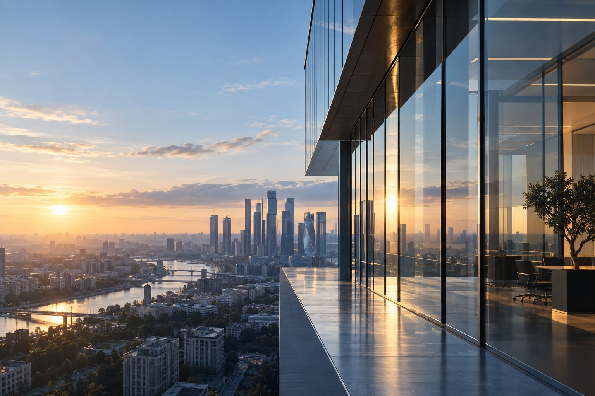

# FINMENTOR — IMAGE ART DIRECTION
## Editorial photography specification

**Scope:** exactly **three** photographic assets on the homepage. No fourth.
**Location:** `/images/editorial/`
**Rule:** production never hotlinks third-party imagery. Assets are licensed or
commissioned, exported locally, and committed.

---

## 0. Status of assets

| Slot | File | Status |
|---|---|---|
| 01 Hero | `hero-capital.*` | **PLACEHOLDER SHIPPED** — awaiting licensed asset |
| 02 Decision environment | `capital-decision.*` | **PLACEHOLDER SHIPPED** — awaiting licensed asset |
| 03 Real estate / investment | `real-assets.*` | **PLACEHOLDER SHIPPED** — awaiting licensed asset |

The shipped placeholders are **generated SVG fields**, not stock photography.
They are deliberately non-representational: a deep navy/graphite tonal field with
a restrained geometric structure and a single warm highlight. They hold the exact
final aspect ratio, focal point and `object-position`, so swapping in the licensed
photograph is a **file replacement with no CSS change**.

A low-quality stock photograph would be worse than the placeholder — it would ship a
cliché into production and set the wrong perceived value. The placeholder is honest.

Shipped placeholder files:

```
images/editorial/hero-capital.svg            2560 × 1440  (16:9)
images/editorial/capital-decision.svg    1920 × 1280  (3:2)
images/editorial/real-assets.svg  1920 × 2400  (4:5)
```

Each is referenced by an `` inside a `<picture>` element that currently carries
**no `<source>` children**. This is deliberate: a `<source type="image/avif">` pointing
at a file that does not exist yet would break the image rather than fall back.

### Swap procedure
1. Export the licensed photograph at the sizes in each spec below.
2. Write `hero-capital.avif`, `.webp`, `.jpg` (+ `-1280`, `-1920`, `-2560` variants)
   into `images/editorial/`.
3. Add the `<source>` lines to the existing `<picture>` and repoint ``:
   ```html
   <picture class="hero__media">
     <source type="image/avif" srcset="images/editorial/hero-capital-1280.avif 1280w, …" sizes="100vw">
     <source type="image/webp" srcset="images/editorial/hero-capital-1280.webp 1280w, …" sizes="100vw">
     
   </picture>
   ```
4. Update the `<link rel="preload">` in `<head>` to the format the browser will select.
5. The `aspect-ratio`, `object-position` and scrim CSS need **no change** — the
   placeholders already hold the final geometry.
6. Re-run `node qa/visual-evidence.mjs` to confirm no layout shift or overflow.

---

## 0b. Generation / sourcing prompts for the three final assets

This environment can author **vector editorial artwork**, which is what ships today.
It cannot produce photographic raster images. The three prompts below are written to be
pasted directly into an image-generation model or handed to a photo researcher or a
commissioned photographer. Each is paired with a hard negative list.

> **Never substitute a generic stock photograph to close this out.** A cliché in the
> hero costs more perceived value than the current restrained artwork does.

### PROMPT 01 — `hero-capital` (2560×1440, 16:9)

> Architectural photograph of a contemporary European business building, shot from a
> low three-quarter angle. Facade of dark glazing set into pale limestone with slim
> metal mullions; strong vertical rhythm, off-centre composition. Late-afternoon
> directional sunlight rakes one vertical edge, leaving a single warm highlight against
> cool graphite and muted blue shadows. Deep, calm, institutional. Large uninterrupted
> area of flat sky and shadow across the left 45% of the frame with no structural
> detail. Shot on a medium-format camera with a tilt-shift lens, verticals corrected,
> natural light only, high dynamic range, no artificial colour grading.

**Negative:** skyline, cityscape panorama, skyscraper cluster, people, cars, signage,
brand marks, logos, lens flare, HDR halos, neon, blue-hour glow, drone view, reflections
of a photographer, holographic overlays, charts, any digital UI.

### PROMPT 02 — `capital-decision` (1920×1280, 3:2)

> Editorial still-life on a dark stone desk surface. A small stack of printed financial
> documents and a folded architectural drawing, a closed leather notebook, a single
> matte pen laid at an angle, a plain glass of water catching one highlight. Single
> soft directional light from the upper left, long quiet shadows, shallow depth of
> field. Muted palette of graphite, stone, warm paper and a single restrained brass
> note. Feels like the desk of someone who has just made a decision, not someone
> working. Shot on medium format, 100mm macro, natural window light.

**Negative:** hands, people, laptop, keyboard, phone, calculator, coffee cup, sticky
notes, printed bar charts or pie charts, trading screens, Bloomberg terminal, stock
tickers, visible logos or legible brand text, flat overhead flat-lay styling, bright
white office.

### PROMPT 03 — `real-assets` (1920×2400, 4:5 portrait)

> Vertical architectural detail of a high-end contemporary mixed-use building in
> Europe. A repeating colonnade or facade bay system in pale stone and bronze-toned
> metal, photographed straight on to emphasise geometry and material quality. Soft
> morning light, restrained contrast, calm and permanent in feeling. Composition leaves
> the top fifth of the frame quiet.

**Negative:** full skyline, whole-building hero shot, sky-dominant composition, people,
cars, retail signage, construction equipment, real-estate-listing aesthetics,
wide-angle distortion, oversaturated blue sky.

### Acceptance test for any candidate image
1. Place it behind the real headline at 1440 and 390 and measure contrast **through the
   scrim** — body text must clear 4.5:1.
2. Cover the logo. The frame must still read as *capital* rather than *office*.
3. If it could plausibly illustrate a generic consulting or SaaS landing page, reject it.

---

## 0c. Crop contract — frozen, so the layout never depends on guesswork

Every slot's aspect ratio, focal point and `object-position` is already committed in
`style.css`. A replacement image that respects the table below drops in with **no CSS and
no layout change**. One that does not will crop badly — the contract is the brief.

| | PHOTO 01 `hero-capital` | PHOTO 02 `capital-decision` | PHOTO 03 `real-assets` |
|---|---|---|---|
| Used by | Hero | Управление капиталом | Бизнес-модели |
| Master | 2400×1500 min (16:10) | 1920×1280 (3:2) | 1920×2400 (4:5) |
| Desktop render | full-bleed behind copy | full-bleed behind copy | fixed column, `clamp(420px, 66vh, 820px)` tall |
| Desktop `object-position` | `68% 42%` | `50% 45%` | `50% 60%` |
| Mobile render | full-bleed, ~88vh | full-bleed | `clamp(190px, 44vw, 280px)` tall |
| Mobile `object-position` | `64% 42%` | `50% 50%` | `50% 55%` |
| Protected zone | **left 40–45% tonally flat** — headline sits there | left ~38% under a 0.86–0.95 navy scrim | top ~20% calm for the overline |
| Scrim applied | 100° directional + vertical | 95° directional + vertical | none — image reads at full value on ivory |
| Loading | `fetchpriority="high"`, preloaded | `lazy` | `lazy` |
| Responsive sources | `<source media>` already wired at 1440 / 1024 / 768 / 390 | single source | single source |

**What each slot must emotionally communicate, in one line each:**

- **PHOTO 01** — *scale and permanence.* An institution that was here before you and will
  be here after. Perspective, not a flat elevation.
- **PHOTO 02** — *judgement.* The moment before a capital decision, shown through materials
  and light rather than through a person.
- **PHOTO 03** — *real assets.* Something built, owned and measurable. Structure and
  materiality, never a skyline postcard.

**What all three must avoid:** smiling people, handshakes, laptops with charts, holograms,
neural-network motifs, glowing dashboards, city skylines, visible branding, drone hero
shots, anything that reads as a stock library thumbnail.

---

## 1. Global standards

| Property | Requirement |
|---|---|
| Colour | deep blue / graphite / warm neutral. Cool shadows, warm highlights. |
| Highlight temperature | must sit beside `--gold-500 #C9A227` without clashing |
| Light | directional, morning or late afternoon, long shadows |
| Contrast | mid-to-high, but **never** crushed blacks behind text |
| People | never the primary subject; no faces; no founder |
| Branding | no legible logos, signage, or product marks |
| Prohibited | fake charts, dashboards, tickers, calculators, handshakes, AI-generated artefacts, city-skyline cliché, drone hero shots |
| Format | AVIF primary, WebP fallback, JPG last resort |
| Colour profile | sRGB, 8-bit |
| Compression target | AVIF q≈50, WebP q≈78 |

### Text legibility contract
Any image that sits behind type carries a **navy scrim**:
`linear-gradient(to right, rgba(8,17,31,0.92) 0%, rgba(8,17,31,0.72) 45%, rgba(8,17,31,0.35) 100%)`
Text contrast is measured **against the scrimmed result**, not the raw photograph.

---

## 2. IMAGE 01 — HERO · `hero-capital`

**Purpose.** Establish institutional authority in the first 5 seconds. The image must
say *capital, stability, scale, discipline, permanence* before a single word is read.

| Property | Value |
|---|---|
| Subject | contemporary business architecture — glass, stone, metal |
| Character | restrained European; sophisticated geometric lines; no ornament |
| Treatment | architectural detail or facade rhythm, **not** a skyline |
| Master export | 2560 × 1440 (16:9) |
| Desktop crop | 16:9, full-bleed right 55% of viewport |
| Mobile crop | 4:5 portrait, 390 × 488 |
| Focal point | right third, upper-middle |
| `object-position` desktop | `72% 38%` |
| `object-position` mobile | `64% 42%` |
| **Negative space** | **left 45% must be tonally flat and uninterrupted** — the headline sits there. No structural edge, no bright element, no high-frequency detail in that band. |
| srcset | 1280 / 1920 / 2560 |
| Loading | `fetchpriority="high"`, preloaded, **not** lazy |
| Alt text | `""` (decorative — the H1 carries the meaning) |
| `aria-hidden` | `true` |

**Direction note.** The strongest version of this frame is a low-angle or straight-on
view of a facade where glazing meets stone, with one plane catching warm directional
light. Avoid symmetry — an off-centre vertical rhythm reads as considered rather than
corporate.

---

## 3. IMAGE 02 — DECISION ENVIRONMENT · `capital-decision`

**Purpose.** Support the capital/decision sections. Communicates *decision making,
capital discipline, analytical precision* — the human judgement behind the system,
without showing a human.

| Property | Value |
|---|---|
| Subject | premium dark desk surface; financial or investment documents, or architectural plans |
| Props | restrained notebook, pen, folded document, glass, metal, stone texture |
| Shot | editorial close-up or medium, shallow depth of field |
| Light | single directional source, soft falloff, visible warm highlight |
| Master export | 1920 × 1280 (3:2) |
| Desktop crop | 3:2, half-column |
| Mobile crop | 3:2 maintained, full width |
| Focal point | centre-left |
| `object-position` | `50% 45%` |
| Negative space | upper-right quadrant kept calm for an optional caption |
| srcset | 960 / 1440 / 1920 |
| Loading | `lazy`, `decoding="async"` |
| Alt text RU | `Рабочая среда принятия финансовых решений` |
| Alt text RO | `Mediul de lucru pentru deciziile financiare` |

**Prohibited specifically here:** hands typing on a laptop, smiling executives, a
calculator, a fake Bloomberg terminal, a printed bar chart, coffee-cup styling.

---

## 4. IMAGE 03 — REAL ESTATE / INVESTMENT · `real-assets`

**Purpose.** Supporting visual for real estate, investment and capital allocation.
Signals asset quality and permanence.

| Property | Value |
|---|---|
| Subject | high-end commercial or mixed-use architecture |
| Treatment | **architectural detail over generic skyline** — a corner, a colonnade, a facade rhythm |
| Character | strong geometry, premium materials, contemporary European |
| People | not required; if present, incidental and unidentifiable |
| Master export | 1920 × 2400 (4:5 portrait) |
| Desktop crop | 4:5 portrait column |
| Mobile crop | 3:2 landscape, 390 × 260 |
| Focal point | lower-centre |
| `object-position` desktop | `50% 60%` |
| `object-position` mobile | `50% 50%` |
| Negative space | top 20% calm for section overline |
| srcset | 768 / 1280 / 1920 |
| Loading | `lazy`, `decoding="async"` |
| Alt text RU | `Коммерческая недвижимость как объект управления капиталом` |
| Alt text RO | `Imobiliare comerciale ca obiect al managementului de capital` |

---

## 5. Founder portrait — existing asset, relocated

`portrait*.{jpg,webp}` already exists in the repository at four sizes and is **kept**.

- It appears **only** in the "Кто стоит за FINMENTOR" / About section.
- It must **not** appear in the hero, nor in the first two sections.
- Treatment: single column, editorial, no glow, no gold ring, no circular crop.
- Existing responsive sources and alt text are preserved unchanged.

---

## 6. Delivery checklist

- [ ] All three assets licensed for commercial web use, licence recorded
- [ ] Exported AVIF + WebP + JPG at every srcset width
- [ ] Hero left 45% verified tonally flat against the real headline
- [ ] Text contrast measured against the scrimmed composite, ≥ 4.5:1
- [ ] `aspect-ratio` set on every `` → zero CLS
- [ ] Hero preload points at the asset the browser actually selects
- [ ] `node qa/visual-evidence.mjs` green at 390 and 1440
