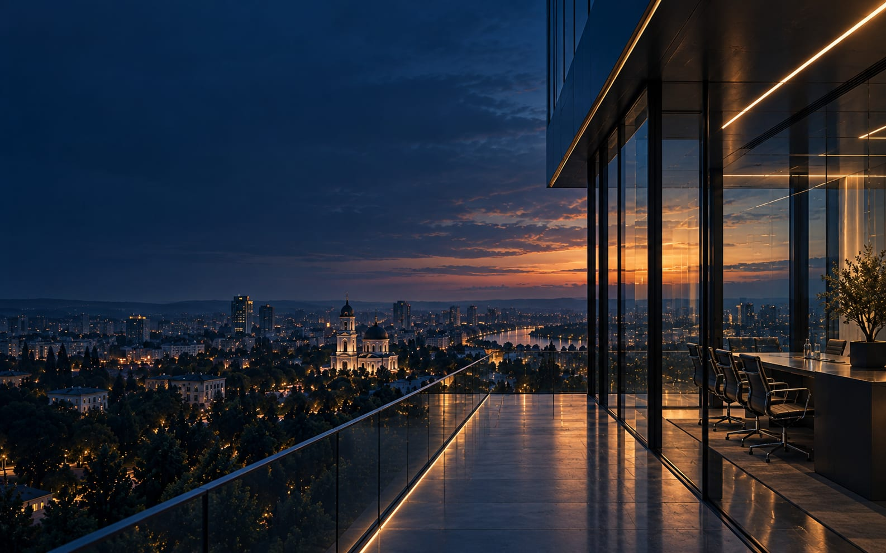
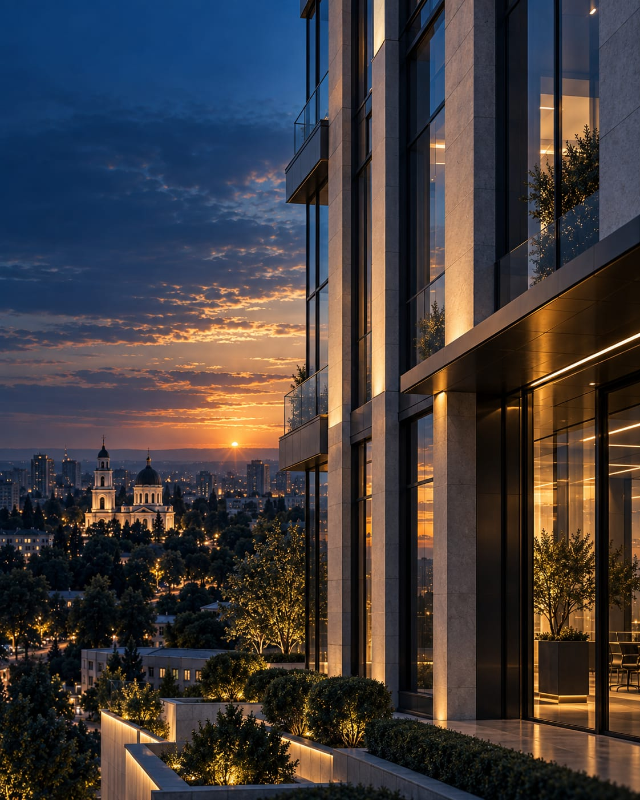

# FINMENTOR — PHOTO ASSET INTEGRATION CHECKLIST

Operational steps for replacing the three homepage SVG placeholders with licensed
photographs. Geometry comes from the **CANONICAL ASSET CONTRACT** in
`IMAGE_ART_DIRECTION.md` (verified against `style.css` at `8676f31`). If this file and
that contract ever disagree, the contract wins.

**Ground rules**
- **No CSS changes are permitted or needed.** Integration touches `index.html`,
  `ro/index.html` and `images/editorial/` only. If an image only works with a CSS change,
  the image is wrong: re-crop or reject it.
- Both editions change together. RU uses `images/editorial/…`, RO uses
  `../images/editorial/…`.
- Keep every existing `width`/`height` attribute. They hold the intrinsic ratio (zero CLS).
- Keep the SVG placeholders in the repo until all three rasters are integrated and QA is
  green. Removing them is a separate, later commit.
- Formats: AVIF primary (q≈50), WebP fallback (q≈78), JPG as the final ``.
  sRGB, 8-bit, metadata stripped.

---

## PHOTO 01 — HERO · `hero-capital`

| Item | Value |
|---|---|
| Production base filename | `images/editorial/hero-capital` → `hero-capital.avif`, `hero-capital.webp`, `hero-capital.jpg` |
| Width variants | `hero-capital-1600.*`, `hero-capital-1200.*`, `hero-capital-780.*` (unsuffixed file = 2400 master export) |
| Recommended master | **2400 × 1500 minimum, ≈16:10**; supply larger if available |
| Variant geometry | 2400×1500 · 1600×1100 · 1200×1000 · 780×975 (4:5). These match the wired `<source>` attributes: crop each from the master, keeping the focal point |
| `object-position` | desktop `68% 42%`; ≤860px `64% 42%` |
| Protected text zone | left 40–45% tonally flat: no edges, highlights or fine detail. The H1 sits there |
| Desktop behavior | full-bleed behind the copy, `object-fit: cover`, 1.035→1 settle animation (off under reduced motion) |
| Mobile behavior (≤860px) | full-bleed, section `min-height: 88svh`, cover crop at `64% 42%` |
| Scrim | desktop: 100° directional + vertical; mobile: vertical only (0.86 / 0.74 / 0.88). Already in CSS, no change |
| AVIF target | `hero-capital{,-1600,-1200,-780}.avif`, q≈50 |
| WebP fallback | `hero-capital{,-1600,-1200,-780}.webp`, q≈78 |
| Loading | **eager**: `fetchpriority="high"` on ``, `<link rel="preload">` in `<head>`. Never lazy |
| Alt-text purpose | decorative. `alt=""` stays empty because the H1 carries the meaning |
| CSS changes permitted | **No** |

**Integration points**: `index.html` ~L255 (preload) and ~L334–343 (`picture.hero__media`);
`ro/index.html` ~L295 and ~L364–373.

Replace each SVG `<source>` with an AVIF + WebP pair, using the same `media` and attributes:
```html
<picture class="hero__media">
  <source media="(min-width: 1440px)" type="image/avif" srcset="images/editorial/hero-capital.avif"      width="2400" height="1500">
  <source media="(min-width: 1440px)" type="image/webp" srcset="images/editorial/hero-capital.webp"      width="2400" height="1500">
  <source media="(min-width: 1024px)" type="image/avif" srcset="images/editorial/hero-capital-1600.avif" width="1600" height="1100">
  <source media="(min-width: 1024px)" type="image/webp" srcset="images/editorial/hero-capital-1600.webp" width="1600" height="1100">
  <source media="(min-width: 768px)"  type="image/avif" srcset="images/editorial/hero-capital-1200.avif" width="1200" height="1000">
  <source media="(min-width: 768px)"  type="image/webp" srcset="images/editorial/hero-capital-1200.webp" width="1200" height="1000">
  <source media="(max-width: 767px)"  type="image/avif" srcset="images/editorial/hero-capital-780.avif"  width="780"  height="975">
  <source media="(max-width: 767px)"  type="image/webp" srcset="images/editorial/hero-capital-780.webp"  width="780"  height="975">
  
</picture>
```
Preload: replace the single SVG preload with media-scoped AVIF preloads, so each browser
preloads the file it will actually select:
```html
<link rel="preload" as="image" type="image/avif" href="images/editorial/hero-capital.avif"      media="(min-width: 1440px)" fetchpriority="high">
<link rel="preload" as="image" type="image/avif" href="images/editorial/hero-capital-1600.avif" media="(min-width: 1024px) and (max-width: 1439px)" fetchpriority="high">
<link rel="preload" as="image" type="image/avif" href="images/editorial/hero-capital-1200.avif" media="(min-width: 768px) and (max-width: 1023px)" fetchpriority="high">
<link rel="preload" as="image" type="image/avif" href="images/editorial/hero-capital-780.avif"  media="(max-width: 767px)" fetchpriority="high">
```

- [ ] Five files per width exported (AVIF, WebP; JPG for the master)
- [ ] Left 40–45% flat at 1440 and 390
- [ ] H1 and body contrast ≥ 4.5:1 measured through the scrim
- [ ] Preload fires once per viewport and nothing is double-fetched (check the network panel)

---

## PHOTO 02 — CAPITAL DECISION · `capital-decision`

| Item | Value |
|---|---|
| Production base filename | `images/editorial/capital-decision` → `capital-decision.avif`, `capital-decision.webp`, `capital-decision.jpg` |
| Width variants | `capital-decision-960.*`, `capital-decision-1440.*` (unsuffixed file = 1920 master export) |
| Recommended master | **1920 × 1280, 3:2** |
| `object-position` | desktop `50% 45%`; ≤900px `50% 50%` |
| Protected text zone | left ~38% sits under the 0.86–0.95 scrim, so keep it low-detail. Subject weight goes centre to centre-right |
| Desktop behavior | full-bleed behind the `#capital-allocation` copy, `object-fit: cover` |
| Mobile behavior (≤900px) | full-bleed behind single-column copy, cover crop at `50% 50%` |
| Scrim | 95° directional (0.95 → 0.34) + vertical (0.66 / 0.18 / 0.70), the same at all widths. Already in CSS, no change |
| AVIF target | `capital-decision{-960,-1440,}.avif`, q≈50 |
| WebP fallback | `capital-decision{-960,-1440,}.webp`, q≈78 |
| Loading | `loading="lazy"`, `decoding="async"`. No preload |
| Alt-text purpose | informative. Names the decision environment. Keep the shipped alt: RU `Рабочая среда принятия решений о капитале`, RO `Mediul de lucru pentru deciziile de capital` |
| CSS changes permitted | **No** |

**Integration points**: `index.html` ~L641–644 and `ro/index.html` ~L671–674
(`picture.capital-management__media`, which has no `<source>` yet).
```html
<picture class="capital-management__media">
  <source type="image/avif" srcset="images/editorial/capital-decision-960.avif 960w, images/editorial/capital-decision-1440.avif 1440w, images/editorial/capital-decision.avif 1920w" sizes="100vw">
  <source type="image/webp" srcset="images/editorial/capital-decision-960.webp 960w, images/editorial/capital-decision-1440.webp 1440w, images/editorial/capital-decision.webp 1920w" sizes="100vw">
  
</picture>
```

- [ ] Copy contrast ≥ 4.5:1 through the scrim at 1440 and 390
- [ ] Environment still legible on the right. The scrim must not erase it

---

## PHOTO 03 — REAL ASSETS · `real-assets`

| Item | Value |
|---|---|
| Production base filename | `images/editorial/real-assets` → `real-assets.avif`, `real-assets.webp`, `real-assets.jpg` |
| Width variants | `real-assets-768.*`, `real-assets-1280.*` (unsuffixed file = 1920 master export) |
| Recommended master | **1920 × 2400, 4:5 portrait** |
| `object-position` | desktop `50% 60%`; ≤900px `50% 55%` |
| Protected text zone | no text over the image. Keep the top ~20% calm so the overline beside it reads cleanly |
| Desktop behavior | sticky left column (4fr of the grid), height `clamp(420px, 66vh, 820px)`, `object-fit: cover` |
| Mobile behavior (≤900px) | static, full width, height `clamp(190px, 44vw, 280px)`: a wide landscape band cut from a portrait master, so the lower-centre subject must survive heavy vertical cropping |
| Scrim | **none**. The image reads at full value on ivory |
| AVIF target | `real-assets{-768,-1280,}.avif`, q≈50 |
| WebP fallback | `real-assets{-768,-1280,}.webp`, q≈78 |
| Loading | `loading="lazy"`, `decoding="async"`. No preload |
| Alt-text purpose | informative. Names the asset class. Keep the shipped alt: RU `Коммерческая недвижимость как объект управления капиталом`, RO `Imobiliare comerciale ca obiect al managementului de capital` |
| CSS changes permitted | **No** |

**Integration points**: `index.html` ~L521–524 and `ro/index.html` ~L551–554
(`figure.industries__figure`). The slot currently has a bare `` and **no `<picture>`**.
Wrap the existing `` in an unclassed `<picture>` and leave the `<figure>` and its
`reveal` class as they are. The CSS targets `.industries__figure img` as a descendant
selector, so it still matches.
```html
<figure class="industries__figure reveal">
  <picture>
    <source type="image/avif" srcset="images/editorial/real-assets-768.avif 768w, images/editorial/real-assets-1280.avif 1280w, images/editorial/real-assets.avif 1920w" sizes="(max-width: 900px) 100vw, 480px">
    <source type="image/webp" srcset="images/editorial/real-assets-768.webp 768w, images/editorial/real-assets-1280.webp 1280w, images/editorial/real-assets.webp 1920w" sizes="(max-width: 900px) 100vw, 480px">
    
  </picture>
</figure>
```

- [ ] After wrapping: rendered `img` height at 1440 and 390 is identical to the SVG
      baseline (wrapper did not change layout)
- [ ] Subject still reads in the 390 band (≈190px tall)

---

## Final verification (all three)

- [ ] `git diff --stat` shows only `index.html`, `ro/index.html` and new files under `images/editorial/`. **`style.css` is untouched**
- [ ] RU and RO markup identical apart from the path prefix and alt language
- [ ] `node qa/visual-evidence.mjs` green at 390 and 1440, with no new overflow or layout shift
- [ ] QA run-all green
- [ ] Licence for each asset recorded
- [ ] Status table in `IMAGE_ART_DIRECTION.md` §0 updated from PLACEHOLDER to SHIPPED
- [ ] Placeholder SVGs removed only in a separate follow-up commit, after sign-off
